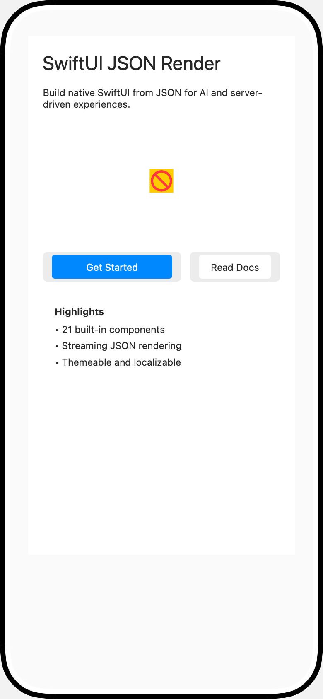
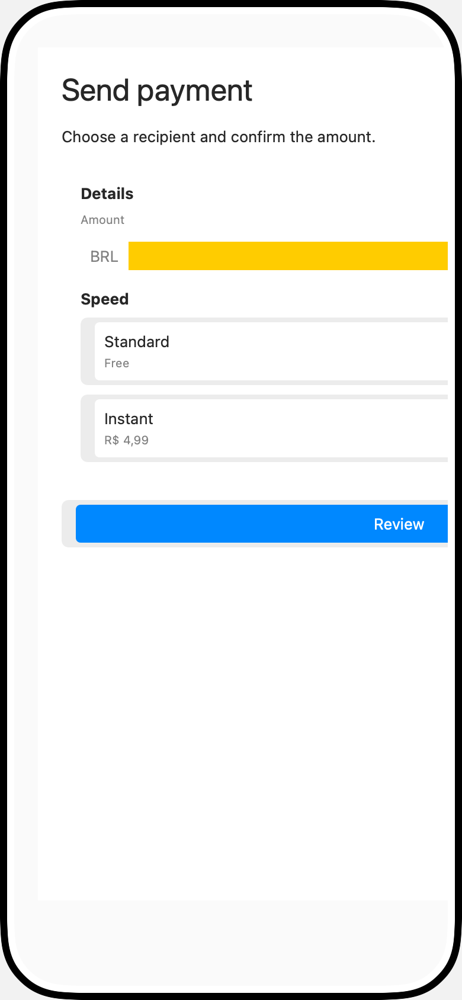
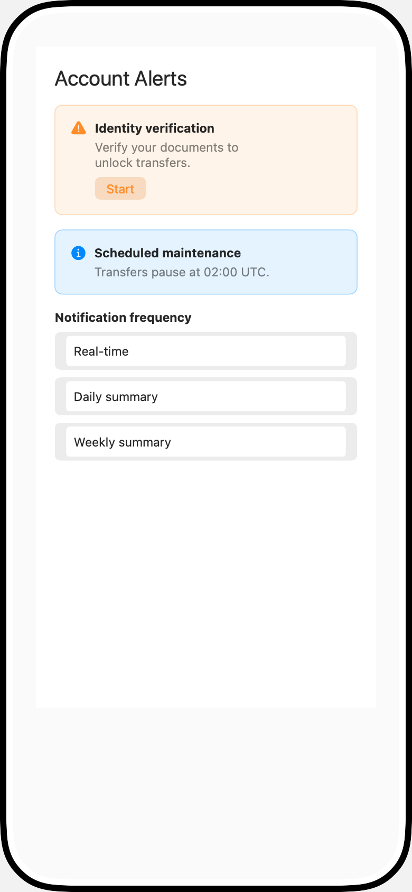
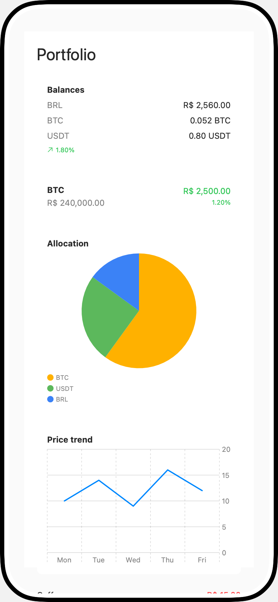

# JSON Code → Rendered UI

This guide pairs each composite JSON tree with the resulting UI screenshot.

## Marketing Overview

### JSON

```json
{
  "type": "Stack",
  "props": { "direction": "vertical", "spacing": 16, "alignment": "leading" },
  "children": [
    { "type": "Heading", "props": { "text": "SwiftUI JSON Render", "level": 1 } },
    { "type": "Text", "props": { "content": "Build native SwiftUI from JSON for AI and server-driven experiences." } },
    { "type": "Image", "props": { "url": "https://example.com/hero.png", "contentMode": "fit", "width": 640, "height": 220 } },
    {
      "type": "Stack",
      "props": { "direction": "horizontal", "spacing": 12, "alignment": "leading" },
      "children": [
        { "type": "Button", "props": { "label": "Get Started", "style": "primary" } },
        { "type": "Button", "props": { "label": "Read Docs", "style": "secondary" } }
      ]
    },
    {
      "type": "Card",
      "props": { "title": "Highlights", "padding": 16 },
      "children": [
        { "type": "Text", "props": { "content": "• 21 built-in components\n• Streaming JSON rendering\n• Themeable and localizable" } }
      ]
    }
  ]
}
```

### Rendered UI



## Form Flow

### JSON

```json
{
  "type": "Stack",
  "props": { "direction": "vertical", "spacing": 16, "alignment": "leading" },
  "children": [
    { "type": "Heading", "props": { "text": "Send payment", "level": 1 } },
    { "type": "Text", "props": { "content": "Choose a recipient and confirm the amount." } },
    {
      "type": "Card",
      "props": { "title": "Details", "padding": 16 },
      "children": [
        { "type": "AmountInput", "props": { "label": "Amount", "placeholder": "0,00", "currency": "BRL" } },
        {
          "type": "ChoiceList",
          "props": {
            "question": "Speed",
            "options": [
              { "id": "standard", "label": "Standard", "description": "Free" },
              { "id": "fast", "label": "Instant", "description": "R$ 4,99" }
            ]
          }
        }
      ]
    },
    {
      "type": "Stack",
      "props": { "direction": "horizontal", "spacing": 12, "alignment": "leading" },
      "children": [
        { "type": "Button", "props": { "label": "Review", "style": "primary" } },
        { "type": "Button", "props": { "label": "Cancel", "style": "secondary" } }
      ]
    }
  ]
}
```

### Rendered UI



## Alerts and Choices

### JSON

```json
{
  "type": "Stack",
  "props": { "direction": "vertical", "spacing": 16, "alignment": "leading" },
  "children": [
    { "type": "Heading", "props": { "text": "Account Alerts", "level": 2 } },
    {
      "type": "Alert",
      "props": {
        "title": "Identity verification",
        "message": "Verify your documents to unlock transfers.",
        "severity": "warning",
        "action": { "label": "Start", "name": "start_kyc" }
      }
    },
    {
      "type": "Alert",
      "props": {
        "title": "Scheduled maintenance",
        "message": "Transfers pause at 02:00 UTC.",
        "severity": "info"
      }
    },
    {
      "type": "ChoiceList",
      "props": {
        "question": "Notification frequency",
        "options": [
          { "id": "realtime", "label": "Real-time" },
          { "id": "daily", "label": "Daily summary" },
          { "id": "weekly", "label": "Weekly summary" }
        ]
      }
    }
  ]
}
```

### Rendered UI



## Financial Dashboard

### JSON

```json
{
  "type": "Stack",
  "props": { "direction": "vertical", "spacing": 16, "alignment": "leading" },
  "children": [
    { "type": "Heading", "props": { "text": "Portfolio", "level": 1 } },
    { "type": "BalanceCard", "props": { "brl": 256000, "btc": 5200000, "usdt": 800000, "showChange": true, "brlChange": 1.8 } },
    { "type": "AssetPrice", "props": { "symbol": "BTC", "price": 240000.0, "change": 2500, "changePercent": 1.2 } },
    {
      "type": "PieChart",
      "props": {
        "title": "Allocation",
        "segments": [
          { "label": "BTC", "value": 60, "color": "#FFB100" },
          { "label": "USDT", "value": 25, "color": "#5CB85C" },
          { "label": "BRL", "value": 15, "color": "#3B82F6" }
        ]
      }
    },
    {
      "type": "LineChart",
      "props": {
        "title": "Price trend",
        "points": [
          { "x": "Mon", "y": 10 },
          { "x": "Tue", "y": 14 },
          { "x": "Wed", "y": 9 },
          { "x": "Thu", "y": 16 },
          { "x": "Fri", "y": 12 }
        ]
      }
    },
    {
      "type": "TransactionList",
      "props": {
        "transactions": [
          { "description": "Coffee", "amount": -1500, "date": "2026-01-15", "category": "Food" },
          { "description": "Salary", "amount": 250000, "date": "2026-01-01", "category": "Income" },
          { "description": "Rent", "amount": -120000, "date": "2026-01-03", "category": "Housing" }
        ]
      }
    }
  ]
}
```

### Rendered UI


